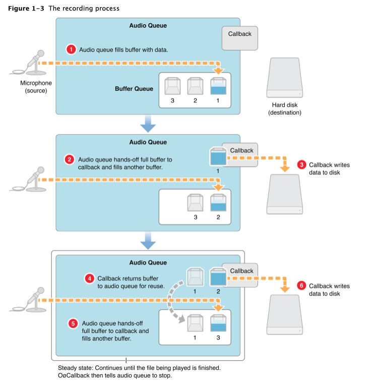
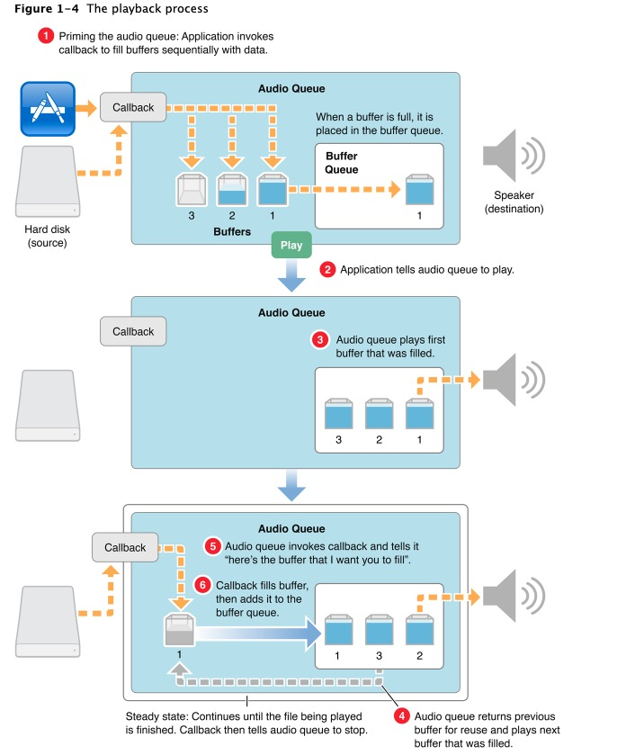

# Audio Queue Services介绍
这个文档会分为以下3个部分介绍Audio Queue Services:


## Audio Queue Services的结构和处理逻辑
- audio queue，它是一个在AudioQueue.h中的。用来连接硬件（麦克风和扬声器），管理内存（buffer的enqueue和消费），控制播放和采集。
- audio queue buffers，audio queue中的内存对象，音频数据和长度存在里面。
- audio quque callback，一个和audio queue绑定的回调，录制的时候，回调告诉你取音频数据；播放的时候，回调告诉你填充数据。

可以将硬件、audio queue、callback看成是一个圆环上的3个点，它们在不停的按照某一个方向在传输数据，buffer就是装数据的容器。
## 使用Audio Queue Services录制音频

这里简单介绍一下录制的时候audio queue和硬件以及callback交互的步骤
1. 硬件采集音频数据，将它填充到空的buffer中
2. audio queue将填充的数据告诉callback，硬件继续采集音频数据
3. 在callback中可以将数据存起来或者发送给其他人
4. callback使用完数据后将buffer重新放到缓冲区中
5. audio queue将空的buffer放在队列的末尾，等待再次使用，硬件继续采集音频数据
6. audio queue将新的填充满的数据告诉callback

### 初始化
```objc
- (instancetype)init {
    if (self = [super init]) {
        _queue = dispatch_queue_create("zf.audioRecorder", DISPATCH_QUEUE_SERIAL);
        [self getAudioSessionProperty];
        [self setupAudioFormat];
        dispatch_async(_queue, ^{
            [self setupAudioQueue];
            [self setupAudioQueueBuffers];
        });
    }
    return self;
}
```

为了确保顺序，这里我们创建了一个串行队列来处理任务。
初始化的时候，先通过AVAudioSession获取当前设备的采样率和处理间隔。然后根据获取的参数计算合适的buffer大小。
```objc
- (void)setupAudioFormat {
    UInt32 mChannelsPerFrame = 1;
    _asbd.mFormatID = kAudioFormatLinearPCM;
    _asbd.mSampleRate = _sampleRate;
    _asbd.mChannelsPerFrame = mChannelsPerFrame;
    //pcm数据范围(−2^16 + 1) ～ (2^16 - 1)
    _asbd.mBitsPerChannel = 16;
    //16 bit = 2 byte
    _asbd.mBytesPerPacket = mChannelsPerFrame * 2;
    //下面设置的是1 frame per packet, 所以 frame = packet
    _asbd.mBytesPerFrame = mChannelsPerFrame * 2;
    _asbd.mFramesPerPacket = 1;
    _asbd.mFormatFlags = kLinearPCMFormatFlagIsSignedInteger | kLinearPCMFormatFlagIsPacked;
}
```

### 创建audio queue
```objc
- (void)setupAudioQueue {
    void *handle = (__bridge void *)self;
    OSStatus status = AudioQueueNewInput(&_asbd, inputCallback, handle, NULL, NULL, 0, &_audioQueue);
    printf("AudioQueueNewInput: %d \n", (int)status);
}
```
这里的AudioQueueInputCallback是一个c的函数，我们可以把self作为一个指针传进去。

### 创建buffer
```objc
- (void)allocateBuffers {
    _bufferSize = _sampleRate * _sampleTime * _asbd.mBytesPerPacket;
    for (int i = 0; i < kNumberBuffers; ++i) {
        AudioQueueBufferRef buffer;
        OSStatus status = AudioQueueAllocateBuffer(_audioQueue, _bufferSize, &buffer);
        printf("recorder alloc buffer: %d, _bufferSize:%u \n", (int)status, (unsigned int)_bufferSize);
        mBuffers[i] = buffer;
    }
}
```

### 开始录制
```objc
- (void)startRecord {
    [self checkAudioAuthorization:^(int code, NSString *message) {
        NSLog(@"checkAudioAuthorization code: %d, message: %@", code, message);
    }];
    dispatch_async(_queue, ^{
        [self enqueueBuffers];
        //start audio queue
        OSStatus status = AudioQueueStart(self.audioQueue, NULL);
        if (status == noErr) {
            self.isRunning = YES;
        }
        printf("AudioQueueStart: %d \n", (int)status);
    });
}
```
我们要开始录制了，录制前我们还是先检查权限。然后将空的buffer放到队列中供audio queue填充数据。
这里需要注意，启动时buffer可能都使用完了，我们这里再次给audio queue填充buffer。

### 停止录制
```objc
- (void)stopRecord {
    dispatch_async(_queue, ^{
        //stop audio queue
        OSStatus status = AudioQueueStop(self.audioQueue, true);
        if (status == noErr) {
            self.isRunning = NO;
        }
        printf("AudioQueueStop: %d \n", (int)status);
    });
}
```

### AudioQueueInputCallback
```objc
static void inputCallback(void * inUserData,
                          AudioQueueRef inAQ,
                          AudioQueueBufferRef inBuffer,
                          const AudioTimeStamp * inStartTime,
                          UInt32 inNumberPacketDescriptions,
                          const AudioStreamPacketDescription *inPacketDescs) {
    ZFAudioQueueRecorder *recorder = (__bridge ZFAudioQueueRecorder *)inUserData;
    if (recorder.isRunning == NO) {
        return;
    }
    //消费音频数据
    if ([recorder.delegate respondsToSelector:@selector(audioRecorder:didRecoredAudioData:length:)]) {
        [recorder.delegate audioRecorder:recorder didRecoredAudioData:inBuffer->mAudioData length:inBuffer->mAudioDataByteSize];
    }
    //将buffer给audio queue
    OSStatus status = AudioQueueEnqueueBuffer(recorder.audioQueue, inBuffer, 0, NULL);
    if (status != noErr) {
        printf("recorder enqueue buffer: %d \n", (int)status);
    }
}
```
这里取到数据后使用代理的方式将数据传递出去，然后立即将使用后的buffer入队

## 使用Audio Queue Services播放音频


这里简单介绍一下录制的时候audio queue和硬件以及callback交互的步骤
1. 应用主动调用callback，将buffer给audio queue
2. audio queue开始工作
3. audio queue将填充的音频数据交给播放器播放
4. audio queue判断如果还有数据，继续播放下一个buffer
5. audio queue将空的buffer告诉callback需要填充数据
6. callback填充完数据，然后将buffer入队

### 初始化
```objc
- (instancetype)init {
    if (self = [super init]) {
        _queue = dispatch_queue_create("zf.audioPlayer", DISPATCH_QUEUE_SERIAL);
        [self getAudioSessionProperty];
        [self setupAudioFormat];
        dispatch_async(_queue, ^{
            [self setupAudioQueue];
            [self setVolume:1.0];
            [self allocateBuffers];
        });
    }
    return self;
}
```
步骤基本和录制的时候一致。

### 创建audio queue
```objc
- (void)setupAudioQueue {
    void *handle = (__bridge void *)self;
    OSStatus status = AudioQueueNewOutput(&_asbd, outputCallback, handle, NULL, NULL, 0, &_audioQueue);
    printf("AudioQueueNewOutput: %d \n", (int)status);
}
```

### 创建buffer
```objc
- (void)allocateBuffers {
    _bufferSize = _sampleRate * _sampleTime * _asbd.mBytesPerPacket;
    for (int i = 0; i < kNumberBuffers; ++i) {
        AudioQueueBufferRef buffer;
        OSStatus status = AudioQueueAllocateBuffer(_audioQueue, _bufferSize, &buffer);
        printf("player alloc buffer: %d, _bufferSize:%u \n", (int)status, (unsigned int)_bufferSize);
        buffer->mUserData = (void *)NO;
        buffer->mAudioDataByteSize = _bufferSize;
        mBuffers[i] = buffer;
    }
}
```

### 开始播放
```objc
- (void)startPlay {
    dispatch_async(_queue, ^{
        [self enqueueBuffers];
        //start audio queue
        OSStatus status = AudioQueueStart(self.audioQueue, NULL);
        if (status == noErr) {
            self.isRunning = YES;
        }
        printf("AudioQueueStart: %d \n", (int)status);
    });
}
```

### 停止播放
```objc
- (void)stopPlay {
    dispatch_async(_queue, ^{
        //stop audio queue
        OSStatus status = AudioQueueStop(self.audioQueue, true);
        if (status == noErr) {
            self.isRunning = NO;
        }
        printf("AudioQueueStop: %d \n", (int)status);
    });
}

```
### 播放音频数据
```objc
- (void)putAudioData:(void *)data length:(UInt32)length {
    if (!_isRunning) {
        return;
    }
    
    //这里处理的有点粗糙，音频数据可能会乱
    AudioQueueBufferRef fillBuffer = NULL;
    for (int i = 0; i < kNumberBuffers; ++i) {
        AudioQueueBufferRef buffer = mBuffers[i];
        BOOL bufferFiled = (BOOL)buffer->mUserData;
        if (!bufferFiled) {
            fillBuffer = buffer;
            break;
        }
    }
    if (fillBuffer == NULL) {
        printf("没有可用buffer, 执行丢帧 \n");
        return;
    }
    memcpy(fillBuffer->mAudioData, data, length);
    fillBuffer->mAudioDataByteSize = length;
    fillBuffer->mUserData = (void *)YES;
}
```
这里需要注意，我使用了audio queue的buffer做为音频的缓冲区，如果录制回调和播放回调不是同步的话（和系统有关）可能会丢帧导致音效不太好的情况。

### AudioQueueOutputCallback
```objc
static void outputCallback(void *outUserData,
                           AudioQueueRef outAQ,
                           AudioQueueBufferRef outBuffer) {
    ZFAudioQueuePlayer *player = (__bridge ZFAudioQueuePlayer *)outUserData;
    if (!player.isRunning) {
        return;
    }
    if (player.playIndex >= kNumberBuffers) {
        player.playIndex = 0;
    }
    AudioQueueBufferRef filledBuffer = player->mBuffers[player.playIndex];
    memcpy(outBuffer->mAudioData, filledBuffer->mAudioData, filledBuffer->mAudioDataByteSize);
    outBuffer->mUserData = (void *)NO;
    OSStatus status = AudioQueueEnqueueBuffer(player.audioQueue, outBuffer, 0, NULL);
    if (status != noErr) {
        printf("play enqueue buffer: %d \n", (int)status);
    }
    player.playIndex ++;
}
```
playIndex是为了保证按顺序enqueue buffer。
